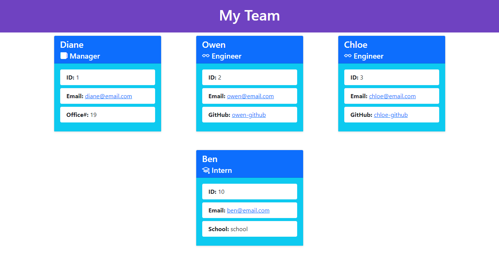

# Team-Profile-Generator

## Description

This app asks the user for information about the user's team, including the manager, engineers, and interns. The app then generates an html page displaying all the team members and their information.

## Installation

Download the files from the github repository, run "npm install" the get the necessary packages.

## Usage

After the installation is complete, run "node index.js" in the terminal within the root directory of the program and you should be good to go! To watch a demo of the app in action please visit: https://watch.screencastify.com/v/RFatFUXjKGrJITwsKwDI.

Here is a screenshot of an example HTML output

## Questions

For any questions, please contact me through github: <a href='http://github.com/kerbunker'>kerbunker</a>
